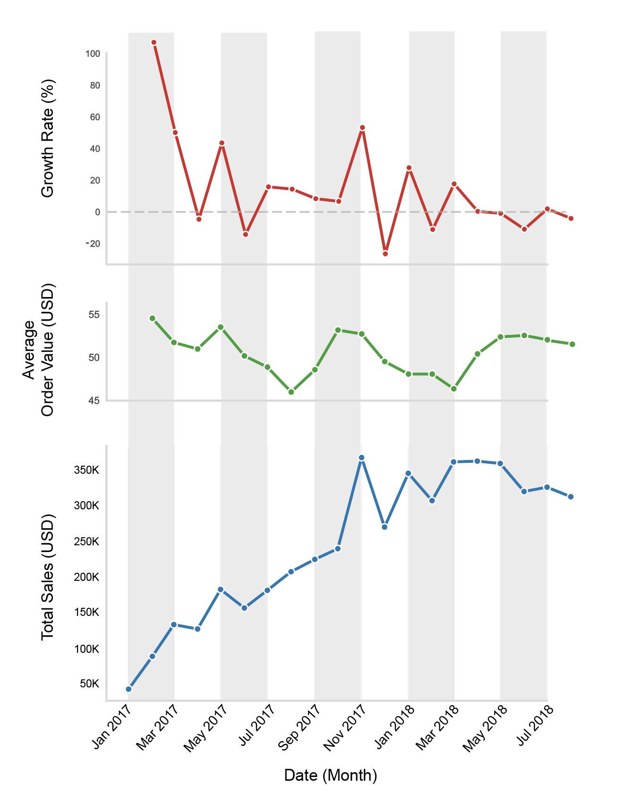

<!-- Title -->
<h1 align="center">E-Commerce Sales Trends and Customer Analysis</h1>

  

---

## Table of Contents

<ol>
  <li><a href="#introduction">Introduction</a></li>
  <li><a href="#executive-summary">Executive Summary</a></li>
  <li><a href="#working-datasets">Working Datasets</a></li>
  <li><a href="#detailed-insights">Detailed Insights</a>
    <ul>
      <li><a href="#sales-trends-and-growth-rate">Sales Trends and Growth Rate</a></li>
      <li><a href="#customer-behavior">Customer Behavior</a></li>
    </ul>
  </li>
  <li><a href="#recommendation">Recommendations</a></li>
  <li><a href="#assumptions-and-caveats">Assumptions and Caveats</a></li>
  <li><a href="#code">Code</a></li>
</ol>

---

## Introduction

Olist is one of Brazil’s leading e-commerce platforms. Founded in 2015, it connects small and medium-sized businesses by connecting them with major online marketplaces across the country, and is now expanding its presence internationally.  

This project uses [real commercial data](https://www.kaggle.com/datasets/olistbr/brazilian-ecommerce) from Olist's early operational period (2016–2018), encompassing over 100,000 orders, to explore the following questions:

- How did Olist’s total sales evolve across months and product categories? Are there clear seasonal patterns or growth phases?  
- Can customers be grouped into clusters based on their purchasing behavior and value?  
- Which customer segments and product categories contribute most to total revenue, and which represent growth opportunities?

---

## Executive Summary

Between 2016 and 2018, Olist processed over 100,000 orders, generating approximately **$4.8 million in sales**. The company experienced rapid expansion in 2017, with an average monthly growth rate of **14.7%**, followed by a period of stabilization in 2018 (**2.6% monthly growth**).  

The **Southeast region**, including São Paulo, Rio de Janeiro, and Minas Gerais, emerged as the dominant market, contributing **63% of total revenue**.  

Customer segmentation revealed **four main behavioral profiles** based on purchasing patterns, satisfaction, and delivery experience:

- **High-Value Premium Buyers:** Highest spend per order and strong satisfaction, though mostly one-time purchasers.  
- **Satisfied Low-Spending Shoppers:** Largest group; highly satisfied but with low transaction values.  
- **Unsatisfied Low-Spending Shoppers:** Lowest satisfaction due to delayed deliveries and high freight costs.  
- **Loyal Repeat Customers:** Small but valuable group with consistent repeat purchases and steady satisfaction.  

Overall, **Clusters 1 and 2 account for over 80% of total revenue**, while improving logistics and customer retention offers significant opportunities for sustained growth.

---

## Working Datasets

  

  <strong>Figure 1.</strong> Entity Relationship Diagram showing the three relational datasets used in this project.  
  See the <a href="https://github.com/Camille-Le-Roy/E-Commerce-Data-Processing-Pipeline">Data Pipeline</a> project for preprocessing details.  
   <em>PK: Primary Key; FK: Foreign Key.</em>

---

## Detailed Insights

### Sales Trends and Growth Rate

- Olist recorded over $4.8 million in online sales between 2016 and 2018 (~$2.2 million per year), receiving an average of 48,000 orders per year. The Average Order Value (AOV) is of 50 USD and remained constant across time.  
- The company experienced strong growth in 2016-2017, with an average monthly growth rate of 14.7%, while it slowed to 2.6% in 2018, indicating a period of stabilization after rapid expansion.  
- The Southeast region (comprising the states of São Paulo, Rio de Janeiro, and Minas Gerais) accounts for 63% of total sales, totaling approximately 3 millions USD.  

 

<!-- 

  

-->

  <strong>Figure 2.</strong> Dashboard showing th monthly growth rate, average order value, and total sales, and its variation across states.  
  Click on the dashboard to open in in Tableau Public and explore data interactively.

---

### Customer Behavior

Four distinct customer segments were identified based on purchasing behavior, satisfaction, and delivery experience:

**Cluster 1 – High-Value Premium Buyers**  
- Customers with the highest spending per order (≈ 192 USD) and strong satisfaction (4.0/5).  
- They purchase high-value products and experience early deliveries.  
- Although mostly one-time buyers, they represent highly profitable transactions.  

**Cluster 2 – Satisfied Low-Spending Shoppers**  
- The largest group, making single, low-value purchases (~34 USD) with excellent satisfaction (4.7/5).  
- They experience early deliveries and pay relatively high freight costs.  
- Represent happy but casual customers with low long-term engagement.  

**Cluster 3 – Unsatisfied Low-Spending Shoppers**  
- Lowest satisfaction segment (1.8/5) with small purchases (~37 USD).  
- Deliveries are slower, and freight costs are high (~37% of total order value).  
- This group highlights potential service and logistics issues affecting customer experience.  

**Cluster 4 – Loyal Repeat Customers**  
- The only segment with repeat purchasing behavior (~2 orders per customer).  
- They are satisfied (4.1/5), buy moderately priced items (~45 USD), and maintain average freight costs.  
- This cluster represents loyal, consistent customers and a key retention opportunity.  

  

  <strong>Figure 3.</strong> Top: Monthly sales by customer cluster during the 2017–2018 period.  
  Bottom: Radar chart illustrating the key behavioral and value attributes of each cluster.

- Overall, the majority of revenue is driven by Cluster 2 (47.1%), followed by Cluster 1 (36.6%), while Cluster 3 and Cluster 4 contribute smaller but significant amounts (10.3% and 6.0% respectively).  
- Only 3.1% of Olist customers made repeat purchases, which nonetheless contributed to 5.6% of the total revenue.  

---

## Recommendation

The analysis highlights key opportunities to improve Olist’s growth trajectory and customer satisfaction.  
Strategic actions should focus on **enhancing retention, optimizing logistics, and differentiating customer experiences** across segments.

- **Retain High-Value Buyers:** Implement loyalty incentives, premium delivery options, or exclusive product bundles to foster repeat purchases among top spenders (Cluster 1).  
- **Convert Satisfied Low-Spending Shoppers:** Encourage higher basket values through targeted upselling, recommendations, or free-shipping thresholds (Cluster 2).  
- **Improve Delivery Performance:** Address delays and high freight costs for low-satisfaction customers via better carrier partnerships.  
- **Strengthen Customer Retention:** Develop reactivation campaigns and personalized follow-ups to increase repeat rates (only 3.1% currently).  
- **Regional Expansion:** Build on Southeast region performance by replicating best practices in emerging markets.  

By implementing these strategies, Olist can **leverage its existing customer base, improve satisfaction, and unlock long-term profitability** across its marketplace network.

---

## Assumptions and Caveats

- The dataset covers a relatively short period and reflects an early stage in the company’s development, limiting seasonal insights.  
- Despite over 100,000 orders, very few repeat customers exist — limiting the classic RFM segmentation approach.  
  Instead, alternative behavioral clustering was applied, offering broader but unconventional insights.  

---

## Code

The analysis is implemented in Python and available in <a href="https://github.com/Camille-Le-Roy/E-Commerce-Sales-Trends-and-Customer-Analysis/blob/main/Olist_customer_behavior_analysis.ipynb" target="_blank" style="color:#D0D0D0; text-decoration:underline;">this Jupyter Notebook</a>.

